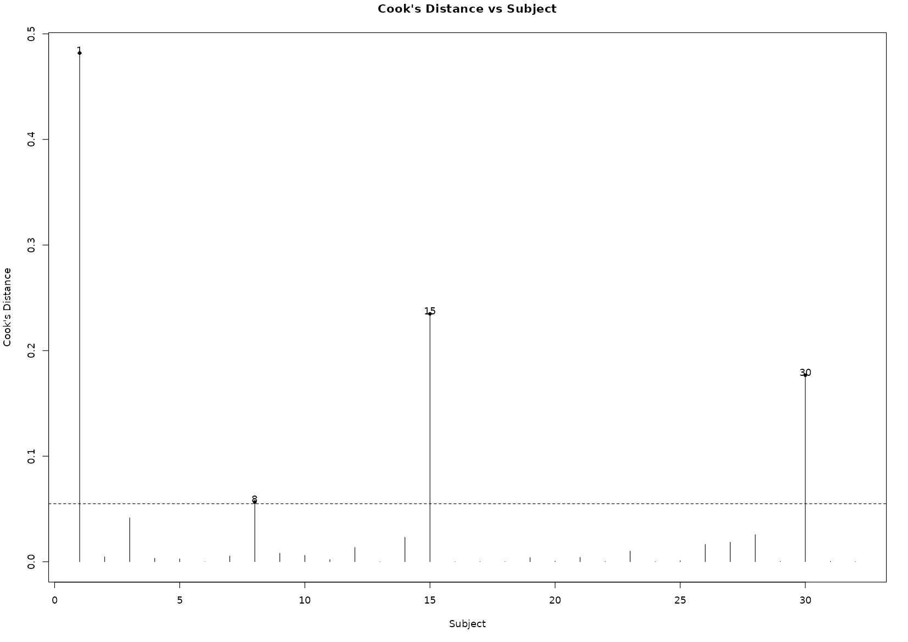
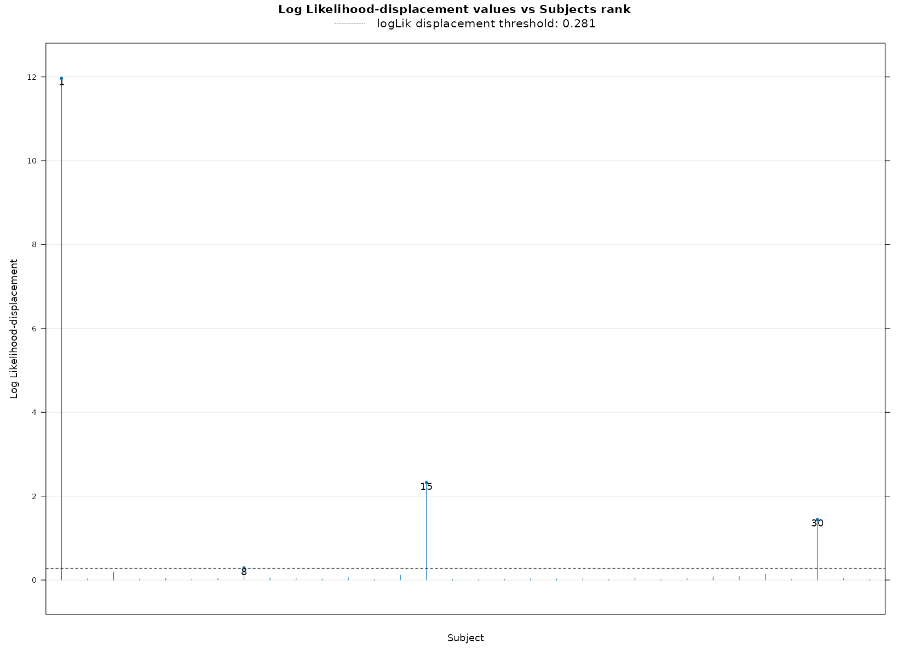

## Influential Diagnostics

#### Cook's Distances

Cook's distances quantify the influence of each subject on the estimated coefficients of their respective treatment (or control) group. A large Cook's distance value indicates that the subject has a substantial impact on the group's coefficient, potentially signaling an influential or outlier observation.

By default, the threshold to highlight influential subjects is set to the 90th percentile of the Cook's distances values of all individuals. This can be modified in the _Advanced Options_ menu.

{width="750"}
_Example Cook's distances plot highliting three subjects with a high influence in the coefficient for the group._

#### log-likelihood Displacements

Log-likelihood displacement values provide insight into the influence of each subject on the overall model. A larger value indicates that the subject has a substantial impact on the model, typically suggesting that including this subject results in a poorer fit of the model. These values can help identify outliers or subjects with an unusually strong influence on the results.

By default, the threshold to highlight influential subjects is set to the 90th percentile of the log-likelihood displacement values of all individuals. This can be modified in the _Advanced Options_ menu.

{width="750"}
_Example log-likelihood displacements plot highliting three subjects with a high influence in the model._