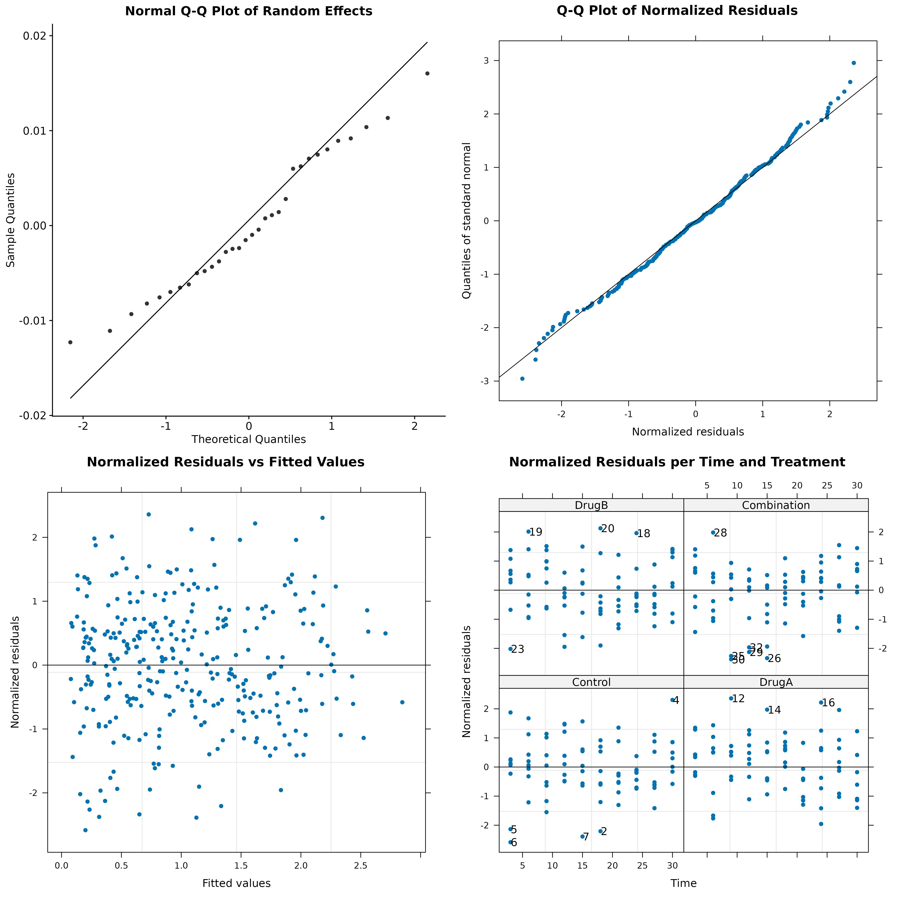
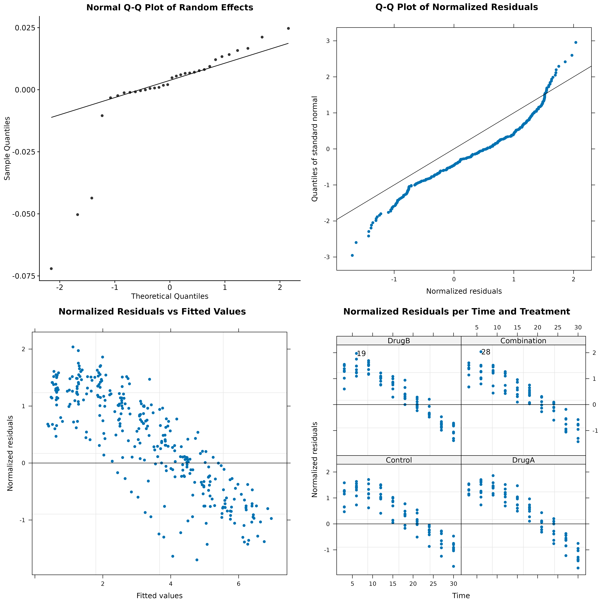

## Model Diagnostics

The two main distributional assumptions of linear mixed-effect models concern the normality of the random effects and the residual terms ([Gałecki & Burzykowski, 2013](https://link.springer.com/book/10.1007/978-1-4614-3900-4)). 

SynergyLMM offers several diagnostic plots and tests for checking these assumptions.

#### Diagnostics of Random Effects

One of the assumptions of the model fitted by SynergyLMM is that the random effects are normally distributed. 

SynerLMM web-app provides visual examination of the normality with normal Q-Q plots of the predicted random effects, together with statistical assessment of their normality using Shapiro-Wilk normality test.

The normality of the random effects cannot be rejected if the p-value of the Shapiro-Wilk test is not significant, and/or the Q-Q plot shows that the data points approximately lie in the diagonal line. If some points lie significantly outside the line, they could be potential outliers that could be identify based on the residuals or in the **Influential Diagnostics**.

#### Diagnostics of residuals

SynerLMM web-app provides Q-Q plots of the standardized residuals, together with statistical assessment of their normality using Shapiro-Wilk normality test.

Additionally, scatter plots of the standardized residuals versus fitted values and standardized residuals per time and per treatment are provided to give information about variability of the residuals and possible outlier observations. 

Observations with absolute standardized residuals greater than the $1−0.05/2$ quantile of the standard normal distribution are identified and reported as potential outlier observations.

#### Examples

**Model Assumptions Adequately Satisfied**
{width="750"}
_Example plots of normally distributed random effects and normal and homoscedastic residuals. Note that most of the points lie on the diagonal line in the two Q-Q plots on the top, indicating normality of the random effects and residuals. Also note how the residuals are randomly distributed around the horizontal line in the bottom plots, indicating homoscedasticity._

**Violation of Model Assumptions**
{width="750"}
_Example plot of non-normally distributed random effects and non-normal, heterocedastic residuals. Note the deviation of several points (which could be potential outliers) from the diagonal line in the two Q-Q plots on the top. Also note how there is a clear pattern of the residuals in the bottom plots, indicating heteroscedasticity._

### Possible Solutions

If the diagnostic plots and tests show evident violations of the model assumptions, there are several solutions that may help improving the model:

- Define the model using unequal variances for the errors. This can be done in the _Advanced Options_ of the **Fit Model for Tumor Growth Data** tab.
- Transform the time units to improve the model fit and ensure that its assumptions are satisfied. For example, a square root or logarithmic transformation of the time units could help improving the model.
- Carefully address potential outliers. Individuals or measurements highlited as potential outliers may warrant further investigation to reveal the reasons behind unusual growth behaviours, and potentially exclude these before re-analysis, after careful reporting and justification.